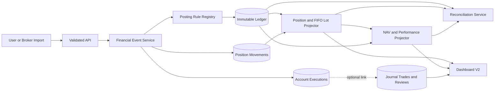

# Trading Journal Accounting Ledger and Performance Foundation

**Document type:** Product and engineering requirements  
**Repository:** `jg-main/TradingJournal`  
**Baseline reviewed:** `main`, commit `86749a1654dc77347bbd83d864d8d2b769a70cbb`  
**Date:** 2026-07-15  
**Audience:** Product owner, technical lead, backend engineers, frontend engineers, QA  
**Status:** Proposed implementation specification  

---

## 1. Executive Summary

The Trading Journal currently provides strong journaling workflows: trade planning, multiple executions, risk snapshots, trade grading, mistake tracking, weekly reviews, account activity, and dashboard analytics.

However, financial performance is currently derived from several independent mechanisms:

- `accounts.startingBalance`
- `accountTransactions` for deposits and withdrawals
- `tradeExecutions` grouped under journal trades
- mutable `trades.status`
- `accountRollforward` snapshots
- separate realized P&L calculations
- separate mark-to-market calculations

This is adequate for an early journal, but it is not a sufficiently reliable foundation for a professional portfolio dashboard. Cash, positions, realized P&L, unrealized P&L, fees, and account equity can diverge because they do not come from one authoritative financial history.

This project must introduce an **immutable, double-entry investment subledger** and a deterministic position engine. The ledger will become the authoritative source for account cash and financial activity. Position, NAV, performance, exposure, and dashboard tables will be rebuildable projections derived from immutable financial events.

The journal domain must remain separate:

- The **accounting domain** answers what financially happened in the brokerage account.
- The **journal domain** answers why the trader acted, whether the process was followed, and what was learned.

The implementation must be additive and migration-safe. Existing journal data must be preserved. The legacy dashboard must remain available until ledger-derived results are reconciled and accepted.

---

## 2. Decision

### 2.1 Approved architecture direction

Implement the accounting foundation before implementing Dashboard V2.

The required sequence is:

1. Define accounting semantics and metric definitions.
2. Add the ledger, instruments, execution, valuation, and projection schema.
3. Implement posting rules and exact numerical calculations.
4. Migrate existing account and execution data.
5. Rebuild and reconcile cash, positions, P&L, and NAV.
6. Run legacy and ledger-derived calculations in parallel.
7. Cut Dashboard V2 over to ledger-derived projections.
8. Deprecate legacy balance and rollforward logic after acceptance.

### 2.2 Database decision

Continue using SQLite.

SQLite is appropriate because this is currently a local-first, single-user application with one primary writer, transactional event creation, and read-heavy dashboard queries. The accounting model and invariants matter more than replacing SQLite with PostgreSQL.

Migration to PostgreSQL is not part of this project.

---

## 3. Normative Language

The words **MUST**, **MUST NOT**, **SHOULD**, **SHOULD NOT**, and **MAY** are requirements:

- **MUST / MUST NOT:** mandatory for acceptance.
- **SHOULD / SHOULD NOT:** expected unless a documented technical reason justifies an exception.
- **MAY:** optional or future-compatible.

---

## 4. Current Project State

### 4.1 Current stack

The existing project uses:

- Next.js App Router
- React
- TypeScript
- Drizzle ORM
- SQLite through `better-sqlite3`
- Tailwind and shadcn/radix-style components
- Vitest and standalone calculation tests
- Playwright
- Local database at `.trading-journal/journal.db`

Relevant locations:

```text
src/app/                 Pages and API routes
src/components/          Shared UI components
src/lib/                 Pure business calculations
src/db/schema.ts         Drizzle schema
src/db/index.ts          SQLite initialization
src/db/migrations/       Migrations
e2e/                     Playwright tests
AGENTS.md                 Engineering conventions
```

### 4.2 Current account model

The current schema contains:

```text
accounts
- currency
- startingBalance

accountTransactions
- type: deposit | withdrawal
- amount
- balanceAfter
- date

accountRollforward
- beginningEquity
- depositsWithdrawals
- realizedGrossPnl
- fees
- endingEquity
- cumulativePnl
- highWaterMark
- drawdown
```

The current account calculation effectively uses:

```text
current balance =
    starting balance
  + deposits
  - withdrawals
  + realized P&L from closed journal trades
```

### 4.3 Current execution and position behavior

Executions are attached directly to a journal trade:

```text
tradeExecutions
- tradeId
- action:
    buy
    sell
    buy_to_cover
    sell_short
    add
    reduce
- quantity
- price
- fees
```

Trade status, open quantity, average entry price, and realized P&L are derived from these executions inside `src/lib/trade-calc.ts`.

Current limitations include:

- Calculations use JavaScript `number` and SQLite `REAL`.
- `add` and `reduce` are journal interpretations rather than economic execution sides.
- Average-cost trade calculations are used as account calculations.
- Over-exits can be silently capped in calculations.
- Trade status participates in determining which trades contribute to performance.
- Journal trades and brokerage positions are treated as if they are the same concept.

### 4.4 Current dashboard behavior

`GET /api/dashboard` currently:

- Resolves one account.
- Loads trades for that account.
- Calculates realized P&L from closed journal trades.
- Calculates open-trade MTM separately.
- Reads account equity and drawdown from `accountRollforward`.
- Uses separate date-filter semantics for current state and period performance.

This produces multiple sources of financial truth.

### 4.5 Current SQLite initialization

`src/db/index.ts` currently enables:

```sql
PRAGMA journal_mode = WAL;
PRAGMA foreign_keys = ON;
```

This project must retain those settings and add the durability and contention settings specified later in this document.

### 4.6 Current documentation constraint

`npm run clean:artifacts` currently removes the `docs` directory. Durable architecture documentation MUST therefore either:

1. Live outside `docs`, preferably under `specs/`, or
2. Be accompanied by a change to `clean:artifacts` so durable documentation is not deleted.

This document SHOULD be committed as:

```text
specs/accounting-ledger-requirements.md
```

---

## 5. Problem Statement

The application currently cannot guarantee that the following values reconcile:

- Cash balance
- Security quantity
- Cost basis
- Realized P&L
- Unrealized P&L
- Fees
- Deposits and withdrawals
- Account equity
- Dashboard return
- Drawdown

The current architecture can produce inconsistent results when:

- A trade status is incorrect.
- A trade is partially closed.
- Multiple journal trades overlap in the same symbol.
- An execution quantity exceeds the journal trade quantity.
- Fees are handled differently by different screens.
- A deposit or withdrawal is edited.
- A trade is deleted or changed after performance was calculated.
- A dividend, interest payment, tax, transfer, or other cash event occurs.
- An account has open positions.
- A current price is missing or stale.
- Account snapshots are out of sync with executions.
- Multiple accounts need to be consolidated.
- Future instruments require multipliers, currencies, or multiple legs.

A professional dashboard must not hide these inconsistencies behind polished charts.

---

## 6. Goals

The implementation MUST provide:

1. An immutable financial event history.
2. Balanced double-entry postings for every monetary event.
3. Exact reconstruction of account cash.
4. Exact reconstruction of instrument quantities.
5. Deterministic FIFO lot allocation.
6. Separate gross P&L, fees, and net P&L.
7. Separate realized and unrealized P&L.
8. Account NAV derived from cash and marked positions.
9. Flow-adjusted performance.
10. Rebuildable position and performance projections.
11. Explicit reconciliation and data-quality reporting.
12. Idempotent imports and migrations.
13. Reversal-based corrections instead of destructive edits.
14. Preservation of all existing journal workflows.
15. A clean data contract for Dashboard V2.
16. A schema that can later support other asset classes without claiming unsupported functionality.

---

## 7. Non-Goals

The first implementation MUST NOT attempt to become:

- A general-purpose ERP.
- A broker-dealer accounting platform.
- A legal books-and-records system.
- A tax-return or tax-lot reporting engine.
- A replacement for official brokerage statements.
- A high-frequency market-data database.
- A multi-user SaaS accounting service.
- A full options, futures, forex, or crypto accounting engine.
- A settlement and margin engine.
- A real-time distributed event-processing system.

### 7.1 Explicit Version 1 scope

Version 1 MUST support:

- Equity instruments.
- Long equity positions.
- Short equity positions.
- Fractional quantities.
- Multiple executions.
- Partial exits.
- Deposits.
- Withdrawals.
- Internal account transfers.
- Commissions and execution fees.
- Dividends.
- Interest income and expense.
- Taxes and withholding.
- Cash adjustments.
- Stock splits.
- Manual and imported executions.
- Account base currency.
- Optional explicit FX rates for cross-currency events.
- Trade-date accounting.

Version 1 MUST store `settlementDate`, but it MUST NOT claim to calculate broker settled cash. Cash shown in Version 1 is trade-date economic cash.

---

## 8. Accounting Glossary for the Development Team

### Account

A brokerage account tracked by the application.

### Journal trade

A user-defined grouping representing a trading idea, setup, plan, execution review, and lesson. It is not itself an accounting record.

### Instrument

A tradable security such as an equity. `AAPL` is a symbol; an instrument additionally includes exchange, currency, asset class, multiplier, and identity.

### Financial event

An immutable business event such as a deposit, execution, fee, dividend, or withdrawal.

### Ledger entry

The accounting record generated from one financial event.

### Posting

One debit or credit line inside a ledger entry.

### Debit and credit

The two sides of double-entry accounting. They are not synonymous with positive and negative.

For this system:

- Asset increases are normally debits.
- Asset decreases are normally credits.
- Liability increases are normally credits.
- Income is normally credited.
- Expenses are normally debited.
- Owner contributions are normally credited.
- Owner withdrawals are normally debited.

### Position

The account's net quantity in one instrument.

### Lot

A remaining portion of an opening execution with its own quantity and cost basis.

### Cost basis

The historical execution value assigned to an open or closed lot.

### Realized P&L

Profit or loss recognized when an open lot is closed.

### Unrealized P&L

Difference between current market value and the historical cost of the still-open position.

### NAV

Net asset value: the marked value of the account after assets and liabilities.

### External cash flow

Capital entering or leaving the account because of the owner, such as a deposit or withdrawal. Trading proceeds are not external flows.

### TWR

Time-weighted return. It measures investment performance while neutralizing deposits and withdrawals.

### Projection

A rebuildable table calculated from immutable source events. A projection is a cache/read model, not the authoritative record.

### Reversal

A new event that economically cancels a previously posted event. Posted history is never edited or deleted.

### Reconciliation

A validation process proving that events, postings, cash, positions, P&L, and projections agree.

---

## 9. Core Design Principles

### 9.1 One financial source of truth

Financial events and their balanced postings MUST be the authoritative monetary history.

The following MUST NOT remain authoritative after cutover:

- `accounts.startingBalance`
- `accountTransactions.balanceAfter`
- `accountRollforward`
- mutable trade status
- dashboard-specific P&L calculations

### 9.2 Journal and accounting are separate domains

A journal trade MAY link to zero, one, or many account executions.

An account execution MAY link to one journal trade or remain unassigned.

Accounting calculations MUST NOT depend on:

- Trade thesis
- Trade grade
- Setup
- Mistake tags
- Whether a review is complete
- Manually assigned trade status

### 9.3 Posted records are immutable

Posted financial events, ledger entries, ledger postings, account executions, and position movements MUST NOT be updated or deleted.

Corrections MUST use:

1. A reversal event.
2. A replacement event when needed.

### 9.4 Projections are disposable

All projection tables MUST be reproducible by replaying immutable events.

The application MUST provide a rebuild operation.

### 9.5 Exact arithmetic

Authoritative financial calculations MUST NOT use binary floating-point arithmetic.

### 9.6 Explicit semantics

Every dashboard metric MUST define:

- Source tables
- Formula
- Time scope
- Currency
- Fee treatment
- Cash-flow treatment
- Missing-data behavior

### 9.7 Data quality is visible

The system MUST surface missing prices, unlinked executions, migration exceptions, stale valuations, and reconciliation failures.

It MUST NOT silently provide a trusted-looking dashboard when accounting integrity is uncertain.

---

## 10. Target Architecture



### 10.1 Write path

```text
Validate business event
→ check idempotency
→ calculate exact amounts
→ generate postings
→ verify debits equal credits
→ create financial event
→ create ledger entry and postings
→ create execution or position movement if applicable
→ update projections
→ update derived journal status if linked
→ commit one SQLite transaction
```

If any step fails, the complete database transaction MUST roll back.

### 10.2 Read path

The dashboard and account pages SHOULD query projection tables, not replay the raw ledger on every request.

---

## 11. Domain Boundaries

### 11.1 Accounting domain

Owns:

- Financial events
- Ledger entries
- Ledger postings
- Account executions
- Cash balances
- Position movements
- Lots
- Positions
- Realized P&L
- Valuation
- NAV
- Returns
- Reconciliation

### 11.2 Journal domain

Continues to own:

- Trade plan
- Setup
- Directional thesis
- Planned entry and stop
- Risk snapshot
- Checklists
- Screenshots
- Grades
- Mistakes
- Lessons
- Weekly reviews

### 11.3 Market-data domain

Owns:

- Instrument prices
- Price timestamps
- Price source
- Staleness
- Market metadata

The accounting domain consumes valuation marks but MUST NOT directly call Yahoo, ClickHouse, Schwab, or another provider inside pure calculation functions.

---

## 12. Required Schema

Names below are recommended. The team MAY adjust names to repository conventions, but the semantics and invariants are mandatory.

---

### 12.1 `accounts`

Retain the existing table and add:

```text
base_currency             TEXT NOT NULL DEFAULT 'USD'
account_type              TEXT
opened_at                 TEXT
closed_at                 TEXT
accounting_enabled_at     TEXT
accounting_migration_at   TEXT
```

Legacy fields:

```text
starting_balance
```

`starting_balance` MUST become read-only after migration and MUST NOT participate in ledger-derived calculations.

---

### 12.2 `instruments`

```text
id                        TEXT PRIMARY KEY
asset_class               TEXT NOT NULL
symbol                    TEXT NOT NULL
exchange                  TEXT
currency                  TEXT NOT NULL
multiplier_decimal        TEXT NOT NULL DEFAULT '1'
tick_size_decimal         TEXT
quantity_scale            INTEGER NOT NULL DEFAULT 8
price_scale               INTEGER NOT NULL DEFAULT 6
underlying_instrument_id  TEXT NULL
expiration_date           TEXT NULL
strike_decimal            TEXT NULL
option_type               TEXT NULL
is_active                 INTEGER NOT NULL DEFAULT 1
metadata_json             TEXT
created_at                TEXT NOT NULL
updated_at                TEXT NOT NULL
```

Constraints:

- Version 1 API MUST accept only `asset_class = 'equity'`.
- `(asset_class, symbol, exchange, currency)` SHOULD be unique.
- Future-specific columns MUST remain nullable.
- `multiplier_decimal` MUST be `"1"` for ordinary equities.

---

### 12.3 `financial_events`

```text
id                        TEXT PRIMARY KEY
sequence_no               INTEGER NOT NULL UNIQUE
account_id                TEXT NOT NULL
event_type                TEXT NOT NULL
occurred_at               TEXT NOT NULL
trade_date                TEXT NOT NULL
settlement_date           TEXT NULL
source                    TEXT NOT NULL
external_reference        TEXT NULL
idempotency_key           TEXT NOT NULL
reversal_of_event_id      TEXT NULL
correction_group_id       TEXT NULL
description               TEXT
metadata_json             TEXT
created_at                TEXT NOT NULL
```

Required event types:

```text
opening_balance
deposit
withdrawal
internal_transfer_in
internal_transfer_out
execution
dividend
interest_income
interest_expense
tax
commission
regulatory_fee
borrow_fee
fx_conversion
stock_split
manual_adjustment
reversal
```

Constraints:

- `(account_id, source, idempotency_key)` MUST be unique.
- `sequence_no` MUST be allocated transactionally.
- `reversal_of_event_id` MUST reference an existing event.
- A source event MUST have at most one effective reversal.
- Events MUST NOT be updated or deleted after insertion.

Recommended sources:

```text
manual
migration
schwab
csv_import
system
restore
```

---

### 12.4 `account_executions`

This becomes the authoritative execution table.

```text
id                        TEXT PRIMARY KEY
financial_event_id        TEXT NOT NULL UNIQUE
account_id                TEXT NOT NULL
instrument_id             TEXT NOT NULL
journal_trade_id          TEXT NULL
journal_trade_leg_id      TEXT NULL
side                      TEXT NOT NULL
quantity_decimal          TEXT NOT NULL
price_decimal             TEXT NOT NULL
execution_currency        TEXT NOT NULL
gross_amount_decimal      TEXT NOT NULL
commission_decimal        TEXT NOT NULL DEFAULT '0'
other_fees_decimal        TEXT NOT NULL DEFAULT '0'
fx_rate_decimal           TEXT NULL
occurred_at               TEXT NOT NULL
trade_date                TEXT NOT NULL
settlement_date           TEXT NULL
external_execution_id     TEXT NULL
reversal_of_execution_id  TEXT NULL
created_at                TEXT NOT NULL
```

Allowed economic sides:

```text
buy
sell
sell_short
buy_to_cover
```

Rules:

- `quantity_decimal` MUST be positive.
- `price_decimal` MUST be non-negative.
- `add` and `reduce` MUST NOT be stored as execution sides.
- UI MAY describe a transaction as “add” or “reduce” based on current exposure.
- An execution MUST be immutable.
- A correction MUST create reversing and replacement executions.
- A single execution MUST NOT automatically cross from long to short or short to long in Version 1. The user/importer must split it into closing and opening executions.
- Migration MUST flag legacy over-exits instead of silently capping them.

---

### 12.5 `ledger_accounts`

A bounded system chart of accounts:

```text
id                        TEXT PRIMARY KEY
code                      TEXT NOT NULL UNIQUE
name                      TEXT NOT NULL
account_type              TEXT NOT NULL
normal_side               TEXT NOT NULL
is_system                 INTEGER NOT NULL DEFAULT 1
is_active                 INTEGER NOT NULL DEFAULT 1
created_at                TEXT NOT NULL
```

Allowed `account_type`:

```text
asset
liability
equity
income
expense
```

Allowed `normal_side`:

```text
debit
credit
```

Users MUST NOT create arbitrary ledger accounts in Version 1.

---

### 12.6 `ledger_entries`

```text
id                        TEXT PRIMARY KEY
financial_event_id        TEXT NOT NULL
account_id                TEXT NOT NULL
entry_type                TEXT NOT NULL
occurred_at               TEXT NOT NULL
trade_date                TEXT NOT NULL
reporting_currency        TEXT NOT NULL
description               TEXT
created_at                TEXT NOT NULL
```

A financial event MAY create multiple entries, but most Version 1 events SHOULD create one.

---

### 12.7 `ledger_postings`

```text
id                        TEXT PRIMARY KEY
ledger_entry_id           TEXT NOT NULL
account_id                TEXT NOT NULL
ledger_account_id         TEXT NOT NULL
instrument_id             TEXT NULL
side                      TEXT NOT NULL
native_currency           TEXT NOT NULL
native_amount_decimal     TEXT NOT NULL
reporting_currency        TEXT NOT NULL
reporting_amount_micros   INTEGER NOT NULL
fx_rate_decimal           TEXT NULL
quantity_decimal          TEXT NULL
memo                      TEXT
created_at                TEXT NOT NULL
```

Rules:

- `side` MUST be `debit` or `credit`.
- Amounts MUST be positive or zero. Sign MUST come from `side`.
- Every entry MUST contain at least two postings.
- Sum of debit `reporting_amount_micros` MUST equal sum of credit `reporting_amount_micros`.
- `reporting_amount_micros` MUST remain within JavaScript safe-integer bounds.
- The application MUST reject entries that do not balance exactly.
- Posted rows MUST NOT be updated or deleted.

---

### 12.8 `position_movements`

Canonical quantity movements, including non-execution corporate actions:

```text
id                        TEXT PRIMARY KEY
financial_event_id        TEXT NOT NULL
account_id                TEXT NOT NULL
instrument_id             TEXT NOT NULL
movement_type             TEXT NOT NULL
quantity_delta_decimal    TEXT NOT NULL
cost_basis_delta_decimal  TEXT NOT NULL
source_execution_id       TEXT NULL
occurred_at               TEXT NOT NULL
created_at                TEXT NOT NULL
```

Movement types:

```text
open_long
close_long
open_short
close_short
split_adjustment
transfer_in
transfer_out
reversal
```

The position engine MUST use signed net quantities:

```text
long quantity  > 0
flat quantity  = 0
short quantity < 0
```

---

### 12.9 `position_lots`

Rebuildable FIFO projection:

```text
id                        TEXT PRIMARY KEY
account_id                TEXT NOT NULL
instrument_id             TEXT NOT NULL
direction                 TEXT NOT NULL
opened_by_execution_id    TEXT NOT NULL
opened_at                 TEXT NOT NULL
original_quantity_decimal TEXT NOT NULL
remaining_quantity_decimal TEXT NOT NULL
unit_cost_decimal         TEXT NOT NULL
total_cost_decimal        TEXT NOT NULL
projection_version        INTEGER NOT NULL
updated_at                TEXT NOT NULL
```

This table MUST be rebuildable and MUST NOT be treated as immutable source data.

---

### 12.10 `position_balances`

Current position projection:

```text
account_id                TEXT NOT NULL
instrument_id             TEXT NOT NULL
net_quantity_decimal      TEXT NOT NULL
long_quantity_decimal     TEXT NOT NULL
short_quantity_decimal    TEXT NOT NULL
cost_basis_decimal        TEXT NOT NULL
average_cost_decimal      TEXT NULL
realized_gross_pnl_micros INTEGER NOT NULL
fees_micros               INTEGER NOT NULL
last_event_sequence       INTEGER NOT NULL
projection_version        INTEGER NOT NULL
updated_at                TEXT NOT NULL
```

Primary key:

```text
(account_id, instrument_id)
```

---

### 12.11 `valuation_marks`

```text
id                        TEXT PRIMARY KEY
instrument_id             TEXT NOT NULL
price_decimal             TEXT NOT NULL
currency                  TEXT NOT NULL
as_of                     TEXT NOT NULL
source                    TEXT NOT NULL
is_official_close         INTEGER NOT NULL DEFAULT 0
metadata_json             TEXT
created_at                TEXT NOT NULL
```

Rules:

- A valuation mark MUST identify its timestamp and source.
- NAV calculations MUST use the latest mark at or before the requested `asOf`.
- Missing prices MUST not be converted to zero.
- Price age MUST be reported.
- Existing `positionPriceSnapshots` MAY be migrated or adapted into this table.

---

### 12.12 `account_cash_balances`

Current cash projection:

```text
account_id                TEXT NOT NULL
currency                  TEXT NOT NULL
balance_micros            INTEGER NOT NULL
last_event_sequence       INTEGER NOT NULL
projection_version        INTEGER NOT NULL
updated_at                TEXT NOT NULL
```

Primary key:

```text
(account_id, currency)
```

---

### 12.13 `daily_account_nav`

```text
account_id                TEXT NOT NULL
date                      TEXT NOT NULL
reporting_currency        TEXT NOT NULL
opening_nav_micros        INTEGER
closing_nav_micros        INTEGER NOT NULL
cash_micros               INTEGER NOT NULL
long_market_value_micros  INTEGER NOT NULL
short_market_value_micros INTEGER NOT NULL
gross_exposure_micros     INTEGER NOT NULL
net_exposure_micros       INTEGER NOT NULL
external_flows_micros     INTEGER NOT NULL
realized_pnl_micros       INTEGER NOT NULL
unrealized_pnl_micros     INTEGER NOT NULL
income_micros             INTEGER NOT NULL
fees_micros               INTEGER NOT NULL
taxes_micros              INTEGER NOT NULL
daily_return_decimal      TEXT NULL
cumulative_twr_decimal    TEXT NULL
high_water_mark_micros    INTEGER NOT NULL
drawdown_micros           INTEGER NOT NULL
drawdown_pct_decimal      TEXT NOT NULL
has_missing_prices        INTEGER NOT NULL DEFAULT 0
has_stale_prices          INTEGER NOT NULL DEFAULT 0
projection_version        INTEGER NOT NULL
updated_at                TEXT NOT NULL
```

Primary key:

```text
(account_id, date)
```

---

### 12.14 `daily_pnl_attribution`

```text
account_id                    TEXT NOT NULL
date                          TEXT NOT NULL
instrument_id                 TEXT NULL
journal_trade_id              TEXT NULL
setup_id                      TEXT NULL
sector_id                     TEXT NULL
direction                     TEXT NULL
realized_pnl_micros           INTEGER NOT NULL
unrealized_pnl_change_micros  INTEGER NOT NULL
income_micros                 INTEGER NOT NULL
fees_micros                   INTEGER NOT NULL
net_pnl_micros                INTEGER NOT NULL
projection_version            INTEGER NOT NULL
```

This table MUST preserve enough dimensions to power Dashboard V2 without recomputing all trades.

---

### 12.15 `reconciliation_runs`

```text
id                        TEXT PRIMARY KEY
account_id                TEXT NULL
started_at                TEXT NOT NULL
completed_at              TEXT
status                    TEXT NOT NULL
source_event_count        INTEGER NOT NULL
posting_count             INTEGER NOT NULL
issue_count               INTEGER NOT NULL
summary_json              TEXT
projection_version        INTEGER NOT NULL
```

### 12.16 `reconciliation_issues`

```text
id                        TEXT PRIMARY KEY
run_id                    TEXT NOT NULL
account_id                TEXT NULL
financial_event_id        TEXT NULL
instrument_id             TEXT NULL
issue_type                TEXT NOT NULL
severity                  TEXT NOT NULL
expected_decimal          TEXT NULL
actual_decimal            TEXT NULL
message                   TEXT NOT NULL
metadata_json             TEXT
created_at                TEXT NOT NULL
```

---

## 13. Exact Numeric Representation

### 13.1 Mandatory rules

New accounting tables MUST NOT use SQLite `REAL` as the canonical representation for:

- Money
- Quantity
- Price
- FX rate
- Cost basis
- Return

The application MUST add an exact-decimal library such as:

```text
decimal.js
```

All financial multiplication, division, addition, subtraction, rounding, and comparison MUST use exact decimal objects.

### 13.2 Recommended representation

Canonical source values:

```text
price_decimal            TEXT
quantity_decimal         TEXT
native_amount_decimal    TEXT
fx_rate_decimal          TEXT
return_decimal           TEXT
```

Fast reporting/projection values:

```text
reporting_amount_micros  INTEGER
balance_micros           INTEGER
pnl_micros               INTEGER
nav_micros               INTEGER
```

Use:

```text
1 currency unit = 1,000,000 micros
```

### 13.3 Rounding policy

The system MUST define one shared rounding module.

Recommended defaults:

```text
Posting/reporting currency: 6 decimal places
Display currency: currency-specific, normally 2 decimal places
Quantity: instrument quantity scale
Price: instrument price scale
FX rate: 10 decimal places
R-multiple: 4 decimal places internally
Returns: 10 decimal places internally
```

Rounding MUST occur only:

- When converting a native amount into reporting micros.
- At a defined posting boundary.
- At display formatting.

Intermediate calculations MUST remain unrounded.

### 13.4 Safe integer requirement

`reporting_amount_micros` MUST remain within:

```text
Number.MIN_SAFE_INTEGER <= value <= Number.MAX_SAFE_INTEGER
```

The posting service MUST reject an event outside this range.

---

## 14. System Chart of Accounts

Seed the following accounts idempotently.

| Code | Name | Type | Normal side |
|---|---|---|---|
| 1000 | Cash | Asset | Debit |
| 1100 | Long Securities at Cost | Asset | Debit |
| 2000 | Short Securities Liability at Cost | Liability | Credit |
| 3000 | Opening Equity | Equity | Credit |
| 3010 | Owner Contributions | Equity | Credit |
| 3020 | Owner Withdrawals | Equity | Debit |
| 4000 | Realized Trading P&L | Income | Credit |
| 4010 | Dividend Income | Income | Credit |
| 4020 | Interest Income | Income | Credit |
| 4030 | FX P&L | Income | Credit |
| 5000 | Commission Expense | Expense | Debit |
| 5010 | Regulatory Fee Expense | Expense | Debit |
| 5020 | Borrow Fee Expense | Expense | Debit |
| 5030 | Interest Expense | Expense | Debit |
| 5040 | Tax and Withholding Expense | Expense | Debit |
| 5050 | Manual Adjustment Expense | Expense | Debit |

`Realized Trading P&L` MAY receive a debit for a realized loss and a credit for a realized gain.

Version 1 MUST expense commissions separately rather than capitalizing them into security cost basis. This is an analytics decision, not tax accounting.

---

## 15. Required Posting Rules

Users MUST create business events. They MUST NOT manually select arbitrary debit and credit accounts in the ordinary UI.

A posting-rule registry MUST convert validated events into entries and postings.

---

### 15.1 Opening balance

For an account opening with USD 10,000 cash:

| Ledger account | Debit | Credit |
|---|---:|---:|
| Cash | 10,000 | — |
| Opening Equity | — | 10,000 |

---

### 15.2 Deposit

Deposit USD 2,000:

| Ledger account | Debit | Credit |
|---|---:|---:|
| Cash | 2,000 | — |
| Owner Contributions | — | 2,000 |

This is an external cash flow and MUST be excluded from trading P&L.

---

### 15.3 Withdrawal

Withdrawal USD 500:

| Ledger account | Debit | Credit |
|---|---:|---:|
| Owner Withdrawals | 500 | — |
| Cash | — | 500 |

This is an external cash flow and MUST be excluded from trading P&L.

---

### 15.4 Long equity purchase

Buy 10 shares at USD 100 with USD 1 commission:

| Ledger account | Debit | Credit |
|---|---:|---:|
| Long Securities at Cost | 1,000 | — |
| Commission Expense | 1 | — |
| Cash | — | 1,001 |

Position movement:

```text
quantity delta: +10
cost basis delta: +1,000
```

---

### 15.5 Long equity sale at a gain

Sell 10 shares at USD 110 with USD 1 commission. FIFO cost basis is USD 1,000:

| Ledger account | Debit | Credit |
|---|---:|---:|
| Cash | 1,099 | — |
| Commission Expense | 1 | — |
| Long Securities at Cost | — | 1,000 |
| Realized Trading P&L | — | 100 |

Position movement:

```text
quantity delta: -10
cost basis delta: -1,000
```

Results:

```text
gross realized P&L = +100
fees                = -1
net realized P&L    = +99
```

---

### 15.6 Long equity sale at a loss

Sell securities for USD 900 with USD 1 commission. FIFO cost basis is USD 1,000:

| Ledger account | Debit | Credit |
|---|---:|---:|
| Cash | 899 | — |
| Commission Expense | 1 | — |
| Realized Trading P&L | 100 | — |
| Long Securities at Cost | — | 1,000 |

---

### 15.7 Short sale

Sell short 10 shares at USD 100 with USD 1 commission:

| Ledger account | Debit | Credit |
|---|---:|---:|
| Cash | 999 | — |
| Commission Expense | 1 | — |
| Short Securities Liability at Cost | — | 1,000 |

Position movement:

```text
quantity delta: -10
short basis: 1,000
```

---

### 15.8 Buy to cover at a gain

Cover 10 shares at USD 90 with USD 1 commission. Original short basis is USD 1,000:

| Ledger account | Debit | Credit |
|---|---:|---:|
| Short Securities Liability at Cost | 1,000 | — |
| Commission Expense | 1 | — |
| Cash | — | 901 |
| Realized Trading P&L | — | 100 |

Net realized P&L is USD 99.

---

### 15.9 Buy to cover at a loss

Cover 10 shares at USD 110 with USD 1 commission. Original short basis is USD 1,000:

| Ledger account | Debit | Credit |
|---|---:|---:|
| Short Securities Liability at Cost | 1,000 | — |
| Commission Expense | 1 | — |
| Realized Trading P&L | 100 | — |
| Cash | — | 1,101 |

---

### 15.10 Dividend

Receive USD 50 dividend with USD 5 withholding:

| Ledger account | Debit | Credit |
|---|---:|---:|
| Cash | 45 | — |
| Tax and Withholding Expense | 5 | — |
| Dividend Income | — | 50 |

---

### 15.11 Interest income

| Ledger account | Debit | Credit |
|---|---:|---:|
| Cash | amount | — |
| Interest Income | — | amount |

---

### 15.12 Interest or borrow expense

| Ledger account | Debit | Credit |
|---|---:|---:|
| Interest Expense or Borrow Fee Expense | amount | — |
| Cash | — | amount |

---

### 15.13 Internal transfer

An internal transfer MUST create two linked events with one `correction_group_id` or dedicated transfer group:

Source account:

| Ledger account | Debit | Credit |
|---|---:|---:|
| Owner Withdrawals or Transfer Clearing | amount | — |
| Cash | — | amount |

Destination account:

| Ledger account | Debit | Credit |
|---|---:|---:|
| Cash | amount | — |
| Owner Contributions or Transfer Clearing | — | amount |

Portfolio-level consolidated performance MUST eliminate paired internal transfers from external-flow calculations.

The implementation MAY add a dedicated transfer-clearing account if this improves consolidation.

---

### 15.14 Stock split

A stock split changes quantity but does not create monetary P&L.

Example: 2-for-1 split:

```text
old quantity: 10
new quantity: 20
total cost basis: unchanged
unit cost: divided by 2
```

The financial event MUST create:

- No non-zero monetary postings.
- A position movement adjusting quantity.
- A lot projection adjustment preserving total basis.

If the ledger requires every event to have an entry, use a zero-value memo entry; do not fabricate P&L.

---

### 15.15 Reversal

A reversal MUST:

1. Reference the original event.
2. Copy each original posting with debit and credit reversed.
3. Create reversing execution and position movement records when applicable.
4. Never modify the original event.
5. Rebuild or update affected projections in the same transaction.

---

## 16. Position and FIFO Lot Engine

### 16.1 Default method

Version 1 MUST use FIFO for account-level cost basis.

### 16.2 Long positions

A `buy`:

- Opens new long FIFO lots.
- MUST NOT close a short position. Short closure requires `buy_to_cover`.

A `sell`:

- Consumes existing long lots oldest first.
- MUST NOT exceed the available long quantity.
- MUST NOT open a short position. Opening a short requires `sell_short`.

### 16.3 Short positions

A `sell_short`:

- Opens new short FIFO lots.
- MUST NOT close a long position.

A `buy_to_cover`:

- Consumes existing short lots oldest first.
- MUST NOT exceed the available short quantity.

### 16.4 Position flips

A single execution that crosses through zero MUST be rejected in Version 1.

The importer or UI must split it into:

```text
close existing position
open opposite position
```

### 16.5 Fractional shares

Quantities MUST support decimal fractions. All comparisons MUST use exact decimal arithmetic.

### 16.6 Corporate actions

Stock splits MUST adjust all open lots proportionally while preserving total cost basis.

Other corporate actions, including mergers, spinoffs, stock dividends, and symbol changes, are outside Version 1 and MUST produce an explicit unsupported-event error rather than an incorrect result.

### 16.7 Deterministic ordering

Lot allocation MUST order events by:

1. `occurred_at`
2. `sequence_no`
3. stable execution ID as final tie-breaker

A projection rebuild MUST produce identical results every time.

---

## 17. Journal Trade P&L vs Account P&L

The application MUST display these as distinct concepts.

### 17.1 Account P&L

Authoritative account P&L:

- Derived from account executions.
- Uses account-level FIFO.
- Includes all account activity.
- Does not depend on journal trade status.
- Drives account NAV and Dashboard V2.

### 17.2 Journal trade P&L

Journal trade P&L:

- Uses only executions linked to that journal trade.
- Supports the user's trade review and R-multiple.
- MAY use a journal-specific average entry calculation for continuity.
- MUST be labeled as journal-trade attribution.
- MUST NOT be used as the authoritative account balance.

### 17.3 Overlapping journal trades

If two journal trades overlap in the same account and instrument:

- Account FIFO allocation remains authoritative.
- Linked execution attribution remains available for journal analysis.
- The UI MUST not imply that both values are guaranteed to match.
- Reconciliation MUST compare account totals, not individual journal trade totals.

---

## 18. Fee Treatment

The current application has different fee policies between dashboard and trade detail MTM. The ledger project MUST remove this ambiguity for account-level metrics.

### 18.1 Account-level rules

- Fees are posted as expenses when incurred.
- Securities cost basis excludes fees in Version 1.
- Unrealized P&L is market-value change relative to open security cost basis.
- Total account P&L includes fee expense exactly once.
- NAV already reflects fees through cash reduction.
- Dashboard code MUST NOT subtract entry fees again from unrealized P&L.

### 18.2 Journal-level rules

Final journal R-multiple SHOULD use net journal-trade P&L after linked execution fees.

Any alternative display MUST be explicitly labeled `gross` or `net`.

---

## 19. Valuation, NAV, and Exposure

### 19.1 Market value

For a long equity:

```text
market value = quantity × price × multiplier
```

For a short equity:

```text
short market value liability = absolute(quantity) × price × multiplier
```

### 19.2 NAV

Version 1 trade-date NAV:

```text
NAV =
    cash
  + long market value
  - short market value liability
```

Because Version 1 does not implement settlement accounting, UI labels MUST NOT claim that cash is broker “settled cash.”

### 19.3 Unrealized P&L

Long position:

```text
unrealized P&L =
    long market value
  - remaining long cost basis
```

Short position:

```text
unrealized P&L =
    remaining short basis
  - current short market value liability
```

### 19.4 Gross and net exposure

```text
gross exposure =
    absolute(long market value)
  + absolute(short market value)

net exposure =
    long market value
  - short market value liability
```

### 19.5 Missing prices

If any non-zero position lacks a valid valuation mark:

- NAV MUST be marked incomplete.
- Missing positions MUST be listed.
- The dashboard MUST show a data-quality warning.
- The system MUST NOT treat the position value as zero.
- The API MAY return the last complete NAV separately.

### 19.6 Stale prices

The projection MUST preserve:

- Price timestamp
- Source
- Age
- Stale status

Stale threshold SHOULD be configurable. No silent carry-forward should be presented as a current live mark.

---

## 20. Performance Methodology

### 20.1 P&L bridge

For a selected period:

```text
closing NAV =
    opening NAV
  + net external flows
  + realized trading P&L
  + change in unrealized P&L
  + dividends
  + interest income
  - commissions and fees
  - interest and borrow expense
  - taxes
  + other approved adjustments
```

The dashboard MUST expose this bridge.

### 20.2 Time-weighted return

The main account return MUST be flow-adjusted.

Version 1 SHOULD calculate daily Modified Dietz returns:

```text
R =
  (ending market value - beginning market value - net cash flow)
  /
  (beginning market value + weighted cash flows)
```

Where each cash flow weight is based on the fraction of the daily period for which the cash was invested.

Daily returns MUST be chain-linked:

```text
cumulative TWR = product(1 + daily return) - 1
```

### 20.3 Money-weighted return

XIRR or money-weighted return MAY be added later. It is not required for Version 1 Dashboard V2.

### 20.4 Drawdown

Drawdown MUST use flow-adjusted performance or NAV after external-flow normalization. Deposits MUST NOT appear as investment gains, and withdrawals MUST NOT appear as trading losses.

The API MUST return:

- Current drawdown
- Maximum drawdown
- High-water mark
- Drawdown start date
- Days underwater
- Recovery date when applicable

---

## 21. Service Architecture

Accounting logic MUST NOT be implemented directly inside API route handlers.

Recommended structure:

```text
src/domain/accounting/
  decimal.ts
  money.ts
  event-types.ts
  posting-rules.ts
  posting-validator.ts
  accounting-event-service.ts
  reversal-service.ts
  chart-of-accounts.ts

src/domain/positions/
  position-engine.ts
  fifo-lot-engine.ts
  position-projector.ts
  position-types.ts

src/domain/performance/
  nav.ts
  modified-dietz.ts
  drawdown.ts
  attribution.ts
  performance-projector.ts

src/domain/reconciliation/
  reconciliation-service.ts
  reconciliation-rules.ts

src/repositories/
  accounting-repository.ts
  position-repository.ts
  performance-repository.ts

src/infrastructure/sqlite/
  sqlite-accounting-repository.ts
  sqlite-position-repository.ts
  sqlite-performance-repository.ts

src/lib/accounting/
  pure calculation modules and tests, if preferred by current repo conventions

scripts/
  migrate-legacy-accounting.ts
  rebuild-accounting-projections.ts
  reconcile-accounting.ts

specs/
  accounting-ledger-requirements.md
  accounting-metric-definitions.md
  accounting-migration-runbook.md
```

The team SHOULD reconcile this with the existing convention that pure reusable calculations live under `src/lib`. A reasonable implementation is:

- Domain orchestration under `src/domain`.
- Pure numerical functions under `src/lib/accounting`, `src/lib/positions`, and `src/lib/performance`.
- Database adapters under `src/infrastructure/sqlite`.

---

## 22. Required Application Services

### 22.1 `AccountingEventService`

Responsibilities:

- Validate event input with Zod.
- Normalize decimal values.
- Resolve instrument and account.
- Enforce idempotency.
- Invoke posting rules.
- Validate balanced postings.
- Persist the complete event atomically.
- Invoke position and performance projectors.
- Return a stable response contract.

### 22.2 `PostingRuleRegistry`

Must map each event type to one tested posting rule.

Adding a future event type MUST require:

- Input schema
- Posting template
- Position-movement behavior
- Unit tests
- Reconciliation behavior
- Documentation

### 22.3 `PositionProjector`

Must:

- Apply executions in deterministic order.
- Maintain FIFO lots.
- Maintain signed position quantities.
- Reject invalid side transitions.
- Calculate realized gross P&L.
- Preserve exact cost basis.
- Update projections transactionally.
- Support full rebuild.

### 22.4 `PerformanceProjector`

Must:

- Use ledger cash.
- Use current position projections.
- Use valuation marks.
- Generate daily NAV.
- Generate daily P&L attribution.
- Calculate Modified Dietz return.
- Calculate high-water mark and drawdown.
- Flag missing and stale valuations.

### 22.5 `ReconciliationService`

Must validate:

- Every ledger entry balances.
- Every event expected to create an entry has one.
- Every execution event has an execution.
- Every execution has position movements.
- Cash projection equals ledger cash postings.
- Position projection equals replayed movements.
- Lot remaining quantities equal position quantities.
- Realized P&L equals lot closures.
- NAV components add correctly.
- No duplicate idempotency keys.
- No orphan references.
- Projection sequence is current.

---

## 23. API Requirements

All routes MUST use Zod and preserve the repository's standard JSON error shape.

### 23.1 Create financial event

```text
POST /api/accounts/:accountId/financial-events
```

Used for:

- Deposit
- Withdrawal
- Dividend
- Interest
- Tax
- Fee
- Adjustment
- Split

The API MUST accept business input, not raw postings.

### 23.2 Create execution

```text
POST /api/accounts/:accountId/executions
```

Example request:

```json
{
  "instrumentId": "instrument-aapl",
  "journalTradeId": "trade-optional",
  "side": "buy",
  "quantity": "10.25",
  "price": "201.37",
  "commission": "1.00",
  "otherFees": "0.02",
  "executionCurrency": "USD",
  "occurredAt": "2026-07-15T14:35:11Z",
  "tradeDate": "2026-07-15",
  "settlementDate": "2026-07-16",
  "source": "manual",
  "idempotencyKey": "manual-generated-uuid"
}
```

### 23.3 Reverse event

```text
POST /api/financial-events/:eventId/reverse
```

Required input:

```json
{
  "reason": "Incorrect quantity",
  "replacement": {
    "optional": "business event payload"
  }
}
```

### 23.4 Account ledger

```text
GET /api/accounts/:accountId/ledger
```

Filters SHOULD include:

- Date range
- Event type
- Instrument
- Source
- Journal trade
- Reversed status

### 23.5 Positions

```text
GET /api/accounts/:accountId/positions
```

Must return:

- Quantity
- Direction
- Cost basis
- Average cost
- Latest price
- Market value
- Realized P&L
- Unrealized P&L
- Price timestamp
- Data-quality flags

### 23.6 Reconciliation

```text
POST /api/accounts/:accountId/reconcile
GET  /api/accounts/:accountId/reconciliation
```

### 23.7 Projection rebuild

```text
POST /api/accounting/rebuild
```

This endpoint SHOULD be restricted to local administrative use. A CLI script is also required.

### 23.8 Dashboard V2

```text
GET /api/dashboard/v2
```

Parameters:

```text
accountId
portfolio=true|false
dateFrom
dateTo
asOf
assetClass
instrumentId
setupId
direction
marketConditionId
compareFrom
compareTo
```

Response groups MUST separate:

```text
currentState
selectedPeriodPerformance
dataQuality
journalProcess
```

---

## 24. Dashboard V2 Response Contract

Recommended high-level response:

```json
{
  "scope": {
    "accountIds": [],
    "reportingCurrency": "USD",
    "asOf": "2026-07-15T20:00:00Z",
    "dateFrom": "2026-01-01",
    "dateTo": "2026-07-15"
  },
  "dataQuality": {
    "ledgerBalanced": true,
    "reconciliationStatus": "passed",
    "missingPriceCount": 0,
    "stalePriceCount": 0,
    "unlinkedExecutionCount": 0,
    "migrationIssueCount": 0
  },
  "currentState": {
    "nav": {},
    "cash": {},
    "positions": {},
    "exposure": {},
    "drawdown": {}
  },
  "selectedPeriodPerformance": {
    "twr": {},
    "pnl": {},
    "pnlBridge": {},
    "periodMatrix": [],
    "equityCurve": [],
    "drawdownSeries": [],
    "attribution": []
  },
  "journalProcess": {
    "tradeCount": 0,
    "expectancyR": null,
    "profitFactor": null,
    "winRate": null,
    "processScore": null,
    "planAdherence": {},
    "mistakeCost": {}
  }
}
```

Account and journal metrics MUST not be merged into ambiguous fields.

---

## 25. UI and Workflow Changes

### 25.1 Account creation

The account form MUST collect:

- Account name
- Broker
- Base currency
- Opening date
- Opening cash balance

Saving the account MUST create an opening-balance event. It MUST NOT merely populate `startingBalance`.

### 25.2 Editing opening balance

A posted opening balance MUST NOT be edited.

The UI must offer:

```text
Correct opening balance
```

This action creates a reversal and replacement event.

### 25.3 Account activity page

Replace deposit/withdrawal-only activity with a ledger-aware event list:

```text
Date
Type
Description
Instrument
Native amount
Reporting amount
Source
Journal trade
Status
Actions
```

The ordinary user should see business terminology. Debit and credit details MAY be available in an expandable technical panel.

### 25.4 Execution form

Store only economic sides:

```text
Buy
Sell
Sell short
Buy to cover
```

The UI MAY show contextual secondary labels:

```text
Buy — open/add long
Sell — reduce/close long
Sell short — open/add short
Buy to cover — reduce/close short
```

### 25.5 Execution correction

The Edit button for a posted execution MUST become:

```text
Correct execution
```

Correction flow:

1. Show original event.
2. Collect reason.
3. Pre-fill replacement.
4. Post reversal.
5. Post corrected replacement.
6. Rebuild affected projections.
7. Display linked correction history.

### 25.6 Trade status

The journal trade may continue displaying:

```text
planned
open
closed
deleted
```

However:

- `open` and `closed` MUST be derived from executions linked to that journal trade.
- Status MUST be treated as a cache/workflow field, not account truth.
- Account positions MUST be derived independently across all account executions.

### 25.7 Reconciliation page

Add an operational page or settings panel showing:

```text
Ledger balanced
Cash reconciled
Positions reconciled
Projection current
Missing prices
Stale prices
Unlinked executions
Migration exceptions
Last rebuild
Last reconciliation
```

### 25.8 Dashboard integrity banner

Dashboard V2 MUST display a clear warning if:

- Reconciliation failed.
- Prices are missing.
- Projections are stale.
- Migration issues remain.

---

## 26. Legacy Data Migration

Migration MUST be additive, idempotent, restart-safe, and non-destructive.

### 26.1 Pre-migration

The application MUST:

1. Create a verified database backup.
2. Run `PRAGMA integrity_check`.
3. Run `PRAGMA foreign_key_check`.
4. Record source row counts.
5. Record source account summary totals.
6. Record migration version.

### 26.2 Account migration

For each account:

- Create required system ledger accounts if not already seeded.
- Create an `opening_balance` event from `accounts.startingBalance`.
- Use the account creation date or earliest known financial date.
- Set account base currency from existing `accounts.currency`.
- Mark the event source as `migration`.

### 26.3 Deposit and withdrawal migration

For each `accountTransactions` row:

- Create a deposit or withdrawal event.
- Preserve date, amount, and notes.
- Generate a deterministic idempotency key from the legacy table and row ID.
- Preserve the legacy row ID in metadata.
- Ignore `balanceAfter` as a source of truth.
- Retain `balanceAfter` only as migration evidence.

### 26.4 Execution migration

For each legacy `tradeExecutions` row:

1. Resolve the account through the parent journal trade.
2. Resolve or create an equity instrument from symbol, account currency, and known metadata.
3. Convert action:

```text
buy          → buy
sell         → sell
sell_short   → sell_short
buy_to_cover → buy_to_cover
add          → buy for long trades
reduce       → sell for long trades
```

Legacy `add` or `reduce` on short trades MUST be reviewed explicitly; they MUST NOT be guessed incorrectly.

4. Preserve the journal trade link.
5. Preserve fees.
6. Generate a deterministic idempotency key.
7. Process in deterministic chronological order.
8. Flag invalid zero quantities.
9. Flag missing timestamps.
10. Flag over-exits.
11. Flag side/position inconsistencies.

### 26.5 Rollforward migration

`accountRollforward` MUST NOT be converted into financial events.

It is a derived legacy snapshot and would duplicate activity already represented by balances, transactions, and executions.

It SHOULD be retained temporarily as reconciliation evidence.

### 26.6 Price migration

Existing current prices and `positionPriceSnapshots` SHOULD be migrated to `valuation_marks` while preserving:

- Price
- Timestamp
- Source
- Instrument
- Metadata

### 26.7 Migration confidence

Each migrated event SHOULD include metadata:

```json
{
  "legacyTable": "trade_executions",
  "legacyId": "...",
  "migrationVersion": 1,
  "confidence": "high|medium|low",
  "warnings": []
}
```

### 26.8 Migration report

Produce a machine-readable and human-readable report:

```text
Accounts processed
Opening balances created
Transactions migrated
Executions migrated
Instruments created
Events posted
Ledger postings created
Positions reconstructed
Rows skipped
Warnings
Blocking errors
Legacy vs ledger cash difference
Legacy vs ledger realized P&L difference
Legacy vs ledger position difference
```

### 26.9 Legacy discrepancies

The migration MUST NOT force ledger values to match legacy values by adding unexplained adjustment entries.

Any difference must be:

- Explained.
- Corrected from source data.
- Or represented as an explicit, user-approved manual adjustment with reason.

---

## 27. Dual-Run and Cutover Strategy

### 27.1 Additive phase

Keep legacy tables and calculations operational while introducing new tables.

### 27.2 Shadow calculations

For every account, calculate:

```text
legacy balance
ledger cash
legacy realized P&L
ledger realized P&L
legacy open quantity
ledger position quantity
legacy account equity
ledger NAV
```

Store or log differences.

### 27.3 Cutover requirements

Dashboard V2 MUST NOT become the default until:

- All ledger entries balance.
- All migration-blocking issues are resolved.
- Cash differences are zero or explicitly explained.
- Position quantity differences are zero.
- Known P&L differences are explained.
- Projection rebuild is deterministic.
- Backup and restore are verified.
- Product owner accepts the reconciliation report.

### 27.4 Deprecation

After cutover:

- Stop writing `accountTransactions`.
- Stop writing `accountRollforward`.
- Stop using `startingBalance` in calculations.
- Stop using `tradeExecutions` as account truth.
- Keep legacy data read-only for at least one release/milestone.
- Remove legacy tables only in a later explicitly approved migration.

---

## 28. Rebuild Requirements

Provide:

```text
make accounting-rebuild
make accounting-reconcile
make accounting-migrate
```

Or equivalent npm scripts.

A rebuild MUST:

1. Acquire a write lock or maintenance mode.
2. Validate source events.
3. Truncate only projection tables.
4. Replay events in deterministic order.
5. Recreate lots, positions, cash, NAV, and attribution.
6. Run reconciliation.
7. Commit only if successful.
8. Leave immutable source events untouched.

A failed rebuild MUST not leave partial projections active.

Recommended technique:

- Rebuild into temporary versioned projection tables.
- Reconcile.
- Atomically activate the new projection version.

---

## 29. SQLite Configuration

Update `src/db/index.ts`:

```sql
PRAGMA journal_mode = WAL;
PRAGMA foreign_keys = ON;
PRAGMA synchronous = FULL;
PRAGMA busy_timeout = 5000;
```

`FULL` is recommended because this is an accounting ledger and write volume is low. The team MAY benchmark `NORMAL`, but any change must be documented as a durability tradeoff.

Also run periodically or before backup/migration:

```sql
PRAGMA integrity_check;
PRAGMA foreign_key_check;
```

### 29.1 Transactions

All event posting MUST use one explicit `better-sqlite3` transaction.

No route may insert an event and its postings through separate uncoordinated calls.

### 29.2 Indexes

At minimum:

```sql
CREATE UNIQUE INDEX idx_financial_events_idempotency
ON financial_events(account_id, source, idempotency_key);

CREATE INDEX idx_financial_events_account_date
ON financial_events(account_id, occurred_at, sequence_no);

CREATE INDEX idx_account_executions_account_instrument_date
ON account_executions(account_id, instrument_id, occurred_at);

CREATE INDEX idx_ledger_entries_account_date
ON ledger_entries(account_id, occurred_at);

CREATE INDEX idx_ledger_postings_entry
ON ledger_postings(ledger_entry_id);

CREATE INDEX idx_ledger_postings_account_ledger_account
ON ledger_postings(account_id, ledger_account_id);

CREATE INDEX idx_position_movements_account_instrument_date
ON position_movements(account_id, instrument_id, occurred_at);

CREATE INDEX idx_valuation_marks_instrument_asof
ON valuation_marks(instrument_id, as_of);

CREATE INDEX idx_daily_account_nav_account_date
ON daily_account_nav(account_id, date);

CREATE INDEX idx_daily_attribution_account_date
ON daily_pnl_attribution(account_id, date);
```

### 29.3 Expected scale

The design SHOULD support at least:

```text
100,000 financial events
500,000 ledger postings
100,000 executions
Several million valuation marks
```

without replacing SQLite.

Do not store high-frequency tick or bar data in the journal SQLite database. Existing external market-data infrastructure should remain separate.

---

## 30. Backup and Restore

The existing backup/restore flow MUST be updated.

### 30.1 Backup requirements

A backup MUST include:

- Schema version
- Accounting version
- Financial events
- Ledger entries
- Ledger postings
- Account executions
- Position movements
- Instruments
- Valuation marks
- Journal tables
- Settings
- Migration metadata

Projection tables MAY be included for fast restore, but they are not authoritative.

### 30.2 Consistent snapshot

The backup MUST use a consistent SQLite snapshot.

Do not copy a live WAL database file without ensuring WAL consistency.

Use one of:

- SQLite online backup API.
- `VACUUM INTO`.
- A transactionally safe application export.

### 30.3 Restore requirements

After restore:

1. Run migrations.
2. Run integrity and foreign-key checks.
3. Verify ledger balance.
4. Rebuild projections if projection version differs.
5. Run reconciliation.
6. Do not open Dashboard V2 as trusted until validation completes.

### 30.4 Restore compatibility

Backups MUST declare:

```text
application version
schema version
accounting event version
projection version
created at
```

---

## 31. Database-Level Integrity Protection

Application checks are mandatory. SQLite triggers SHOULD also protect immutable tables.

Recommended behavior:

```text
financial_events     no UPDATE, no DELETE
ledger_entries       no UPDATE, no DELETE
ledger_postings      no UPDATE, no DELETE
account_executions   no UPDATE, no DELETE
position_movements   no UPDATE, no DELETE
```

Projection tables remain mutable and rebuildable.

The implementation MAY provide a controlled migration mode that disables immutability triggers only during schema migration, never during ordinary application use.

---

## 32. Error Handling

Required domain errors:

```text
ACCOUNT_NOT_FOUND
INSTRUMENT_NOT_FOUND
DUPLICATE_EVENT
UNSUPPORTED_EVENT_TYPE
UNSUPPORTED_ASSET_CLASS
INVALID_DECIMAL
AMOUNT_OUT_OF_RANGE
UNBALANCED_ENTRY
INSUFFICIENT_LONG_QUANTITY
INSUFFICIENT_SHORT_QUANTITY
POSITION_FLIP_NOT_SUPPORTED
MISSING_FX_RATE
MISSING_VALUATION
STALE_PROJECTION
EVENT_ALREADY_REVERSED
IMMUTABLE_RECORD
MIGRATION_BLOCKED
RECONCILIATION_FAILED
```

Errors MUST be deterministic and testable.

The UI MUST show business-readable messages and MAY expose technical details in development mode.

---

## 33. Multi-Currency Foundation

### 33.1 Version 1 behavior

Every account has one base/reporting currency.

If an execution or cash event uses another currency:

- An explicit FX rate MUST be supplied.
- Native amount MUST be stored.
- Reporting amount MUST be calculated exactly.
- Missing FX rate MUST reject the event.

### 33.2 No automatic FX assumptions

The system MUST NOT silently use `1.0` for differing currencies.

### 33.3 Future FX conversion

The schema and event taxonomy support explicit FX conversions, but automated FX valuation is outside Version 1.

---

## 34. Future Asset Classes

The schema must be extensible, but Version 1 posting rules are equities only.

Future work will require dedicated designs for:

### Options

- Underlying instrument
- Expiration
- Strike
- Put/call
- Contract multiplier
- Multi-leg trades
- Exercise and assignment
- Premium accounting
- Expiration

### Futures

- Contract multiplier
- Tick value
- Expiration
- Daily variation margin
- Contract rolls

### Forex

- Base and quote currencies
- Lots
- Realized FX P&L
- Cross-currency valuation

### Crypto

- Venue
- Trading pairs
- Network fees
- Funding
- 24/7 valuation

The team MUST NOT implement generic calculations that treat these instruments as equities.

---

## 35. Testing Requirements

### 35.1 Unit tests

Use Vitest and current pure-function conventions.

Required test groups:

#### Decimal and money

- Exact decimal addition.
- Multiplication.
- Division.
- Rounding.
- Safe-integer overflow rejection.
- Negative/positive handling.

#### Posting rules

- Opening balance.
- Deposit.
- Withdrawal.
- Long buy.
- Long partial sell.
- Long full sell.
- Long sale at loss.
- Short sale.
- Partial cover.
- Full cover.
- Short loss.
- Dividend with withholding.
- Interest income.
- Interest expense.
- Commission.
- Internal transfer.
- Split.
- Reversal.

Every posting-rule test MUST assert:

```text
debits == credits
expected ledger accounts
expected exact amounts
expected position movement
```

#### FIFO lot engine

- Single lot.
- Multiple lots.
- Partial lot consumption.
- Multi-lot consumption.
- Fractional quantities.
- Long and short.
- Same timestamp deterministic ordering.
- Over-close rejection.
- Position-flip rejection.
- Reversal.
- Split adjustment.
- Rebuild determinism.

#### NAV and performance

- Long-only NAV.
- Short-only NAV.
- Mixed long/short NAV.
- Missing price.
- Stale price.
- Deposit excluded from P&L.
- Withdrawal excluded from P&L.
- Modified Dietz with intraday flow.
- Chained TWR.
- Drawdown and recovery.
- Fee included once.
- Dividend and tax attribution.

#### Reconciliation

- Balanced account.
- Unbalanced injected fixture.
- Missing posting.
- Orphan execution.
- Position mismatch.
- Lot mismatch.
- Projection sequence mismatch.

### 35.2 Integration tests

Must use temporary SQLite databases and verify:

- One atomic event transaction.
- Rollback on posting failure.
- Unique idempotency enforcement.
- Immutability triggers.
- Foreign keys.
- Projection update.
- Full rebuild.
- Rebuild after corruption.
- Migration restart safety.
- Backup and restore.
- API response contracts.

### 35.3 Migration fixtures

Create representative legacy fixtures:

1. Empty account.
2. Cash-only account.
3. Deposits and withdrawals.
4. Open long trade.
5. Closed long trade.
6. Partial exit.
7. Open short trade.
8. Closed short trade.
9. Multiple journal trades in one symbol.
10. Fees.
11. Missing execution date.
12. Legacy `add` and `reduce`.
13. Invalid over-exit.
14. Missing current price.

### 35.4 End-to-end tests

Playwright flows:

1. Create account with opening cash.
2. Add deposit.
3. Plan trade.
4. Execute buy.
5. Verify position and cash.
6. Add valuation.
7. Verify NAV and unrealized P&L.
8. Partial sell.
9. Verify realized and unrealized P&L.
10. Close position.
11. Verify journal status and account position.
12. Correct execution through reversal.
13. Run reconciliation.
14. Open Dashboard V2.
15. Backup and restore.

### 35.5 Property/invariant tests

The team SHOULD add randomized tests asserting:

- Every generated entry balances.
- Cash equals posting replay.
- Positions equal movement replay.
- Lots sum to position quantity.
- Rebuild output equals incremental projection output.

### 35.6 Quality gate

The final milestone MUST pass:

```text
make lint
make typecheck
make build
make test-all
make playwright
make accounting-reconcile
```

---

## 36. Performance and Operational Targets

Targets on typical local development hardware:

```text
Single event post:                   < 100 ms typical
Account positions API:              < 300 ms typical
Dashboard V2 API:                   < 750 ms typical
Reconcile 100,000 events:           < 30 seconds
Rebuild 100,000 events:             < 60 seconds
```

These are engineering targets, not guarantees across all hardware.

Dashboard API performance MUST come from indexed projections, not bypassing correctness.

---

## 37. Suggested Implementation Milestones

### Milestone A — Accounting specification and scaffolding

Deliver:

- This requirement committed under `specs/`.
- Metric definitions.
- Decimal library.
- Domain types.
- Chart of accounts.
- Pure posting-rule skeleton.
- SQLite configuration changes.
- No production cutover.

Acceptance:

- Team review completes.
- Accounting examples are agreed.
- No ambiguous fee or P&L semantics remain.

### Milestone B — Immutable ledger

Deliver:

- Financial events.
- Ledger entries.
- Ledger postings.
- Idempotency.
- Reversals.
- Immutability triggers.
- Deposit/withdrawal/opening-balance rules.
- Unit and integration tests.

Acceptance:

- Every event balances.
- Reversal works.
- No legacy behavior changed yet.

### Milestone C — Instruments, executions, positions, and FIFO

Deliver:

- Instruments.
- Account executions.
- Position movements.
- FIFO lot engine.
- Current cash and position projections.
- Long and short equity posting rules.
- Execution APIs.
- Trade-linked execution workflow.

Acceptance:

- Cash and positions reconstruct exactly from events.
- Rebuild is deterministic.
- Existing trade planning and review remain functional.

### Milestone D — Valuation and performance

Deliver:

- Valuation marks.
- NAV.
- Realized/unrealized separation.
- Exposure.
- Modified Dietz TWR.
- Drawdown.
- Attribution.
- Data-quality flags.

Acceptance:

- NAV bridge reconciles.
- Deposits and withdrawals do not distort return.
- Missing prices block trusted NAV.

### Milestone E — Legacy migration and dual run

Deliver:

- Migration scripts.
- Migration report.
- Shadow comparison.
- Reconciliation UI/API.
- Backup/restore updates.

Acceptance:

- No destructive legacy changes.
- All blocking migration issues resolved.
- Product owner approves account-level reconciliation.

### Milestone F — Dashboard V2

Deliver:

- New API contract.
- Portfolio-state metrics.
- NAV and drawdown chart.
- P&L bridge.
- Exposure and risk.
- Period matrix.
- Attribution.
- Journal-process panels.
- Integrity banner.
- Dense professional layout.

Acceptance:

- Dashboard reads only ledger-derived account metrics.
- Journal analytics remain clearly labeled.
- Legacy dashboard remains available behind a fallback during initial release.

### Milestone G — Legacy retirement

Deliver:

- Stop legacy writes.
- Mark legacy tables deprecated.
- Remove unused legacy calculation paths.
- Update help, README, and `AGENTS.md`.
- Final cleanup in a separate reviewed migration.

Acceptance:

- No active code depends on legacy account truth.
- Full quality gate passes.
- Backup from pre-ledger version can still restore and migrate.

---

## 38. Expected Repository Deliverables

At minimum:

```text
specs/accounting-ledger-requirements.md
specs/accounting-metric-definitions.md
specs/accounting-migration-runbook.md

src/db/schema.ts updates
src/db/migrations/<new migrations>

src/lib/accounting/*
src/lib/positions/*
src/lib/performance/*
src/lib/reconciliation/*

src/domain/accounting/*
src/domain/positions/*
src/domain/performance/*
src/domain/reconciliation/*

src/app/api/accounts/[id]/financial-events/*
src/app/api/accounts/[id]/executions/*
src/app/api/accounts/[id]/positions/*
src/app/api/accounts/[id]/reconciliation/*
src/app/api/financial-events/[id]/reverse/*
src/app/api/dashboard/v2/*

scripts/migrate-legacy-accounting.ts
scripts/rebuild-accounting-projections.ts
scripts/reconcile-accounting.ts

Focused unit tests
SQLite integration tests
Migration fixtures
Playwright workflows
README updates
Help-page updates
AGENTS.md updates
Backup/restore updates
```

The exact tree may be adjusted, but no required capability may be omitted.

---

## 39. Documentation Updates

### README

Add:

- Accounting architecture summary.
- Migration instructions.
- Rebuild and reconciliation commands.
- Backup warning.
- Dashboard metric source.

### In-app Help

Add:

- Difference between account and journal trade.
- Gross vs net P&L.
- Realized vs unrealized P&L.
- NAV.
- Deposits and withdrawals.
- Reversals.
- Reconciliation warnings.
- Trade-date cash limitation.

### `AGENTS.md`

Update:

- New computation ownership.
- Immutable table rules.
- Exact-decimal requirement.
- No direct accounting writes from API routes.
- Posting-rule test requirement.
- Rebuild and reconciliation quality gates.
- New source-of-truth hierarchy.
- Removal of fee-policy divergence for account metrics.
- Durable documentation location.

### Cleanup script

Either:

- Store durable specifications under `specs/`, or
- Stop deleting durable project documentation from `npm run clean:artifacts`.

---

## 40. Acceptance Criteria

The project is complete only when all criteria below pass.

### Data integrity

- [ ] Every ledger entry balances exactly.
- [ ] Posted source records cannot be updated or deleted.
- [ ] Duplicate imports do not create duplicate financial events.
- [ ] Corrections use reversal and replacement events.
- [ ] Cash is reconstructable from postings.
- [ ] Positions are reconstructable from movements.
- [ ] FIFO lots reconcile to positions.
- [ ] Realized P&L reconciles to lot closures.
- [ ] NAV components reconcile.
- [ ] Projections rebuild deterministically.
- [ ] Reconciliation reports no blocking issues.

### Migration

- [ ] Existing accounts are preserved.
- [ ] Existing journal trades are preserved.
- [ ] Existing executions are linked to migrated account executions.
- [ ] Deposits and withdrawals are migrated.
- [ ] Price history is migrated or mapped.
- [ ] Legacy rollforward is not double-counted.
- [ ] Invalid legacy data is reported, not silently corrected.
- [ ] Migration is idempotent and restart-safe.
- [ ] A pre-migration backup is verified.

### Product behavior

- [ ] Users can create opening balances, deposits, withdrawals, and executions.
- [ ] Users can correct posted events.
- [ ] Journal workflows continue to work.
- [ ] Account positions are independent of journal trade status.
- [ ] Dashboard clearly separates current state and selected-period performance.
- [ ] Fees appear exactly once.
- [ ] Deposits do not appear as profit.
- [ ] Withdrawals do not appear as losses.
- [ ] Missing prices are visible.
- [ ] Account and journal P&L are clearly labeled.

### Engineering

- [ ] New accounting calculations use exact decimals.
- [ ] No new authoritative accounting column uses SQLite `REAL`.
- [ ] APIs use Zod.
- [ ] Writes are atomic.
- [ ] Required indexes exist.
- [ ] Full quality gate passes.
- [ ] Backup and restore are tested.
- [ ] README, Help, and AGENTS are updated.

---

## 41. Risks and Mitigations

### Risk: building a general accounting system

**Mitigation:** Use a fixed chart of accounts and event-specific posting rules. Do not expose arbitrary journal entries to ordinary users.

### Risk: migration differences from legacy calculations

**Mitigation:** Preserve legacy data, dual-run both models, produce explicit reconciliation reports, and prohibit unexplained balancing adjustments.

### Risk: confusing journal trade P&L and account P&L

**Mitigation:** Separate domains, API fields, UI labels, and formulas.

### Risk: decimal complexity

**Mitigation:** Centralize decimal and money types. Prohibit ad hoc `number` calculations.

### Risk: projection corruption

**Mitigation:** Treat projections as disposable, version them, and provide deterministic rebuilds.

### Risk: future multi-asset overreach

**Mitigation:** Implement only equity posting rules in Version 1. Reject unsupported asset classes explicitly.

### Risk: hidden missing market data

**Mitigation:** NAV completeness and price age are first-class response fields and UI warnings.

### Risk: direct database writes bypassing invariants

**Mitigation:** Central accounting service, repository boundary, immutable-table triggers, code review rule, and integration tests.

---

## 42. Product Decisions Resolved by This Specification

Unless the product owner explicitly changes them before implementation:

| Decision | Version 1 choice |
|---|---|
| Database | SQLite |
| Accounting scope | Investment subledger |
| Accounting date basis | Trade date |
| Settled cash | Not implemented |
| Supported financial asset | Equity |
| Long positions | Supported |
| Short positions | Supported |
| Cost basis | FIFO for account accounting |
| Journal trade calculation | Separate attribution |
| Commission treatment | Separate expense |
| Source arithmetic | Exact decimal |
| Projection amounts | Integer micros |
| Corrections | Reversal plus replacement |
| Position flips | Reject; require split executions |
| Missing price | Incomplete NAV, never zero |
| Main return | Daily Modified Dietz, chain-linked |
| Money-weighted return | Future |
| Corporate action | Stock split only |
| Multi-currency | Explicit FX rate required |
| Tax reporting | Out of scope |
| Legacy tables | Preserve during migration |
| Dashboard cutover | Only after reconciliation |

---

## 43. Final Engineering Direction

Do not redesign Dashboard V2 on top of the existing `startingBalance + transactions + closed journal trades + rollforward + separate MTM` model.

Build one authoritative financial history:

```text
Financial events
→ balanced ledger postings
→ position movements
→ FIFO lots and positions
→ valuation
→ NAV and performance
→ reconciliation
→ Dashboard V2
```

Preserve the journal as the behavioral and process-analysis layer:

```text
Plans
→ linked executions
→ risk
→ grading
→ mistakes
→ reviews
→ journal analytics
```

The final product should provide both:

1. **Financial truth:** trustworthy cash, positions, NAV, P&L, exposure, and returns.
2. **Trading improvement:** setup quality, execution discipline, mistakes, and lessons.

Neither domain should be allowed to corrupt the other.
